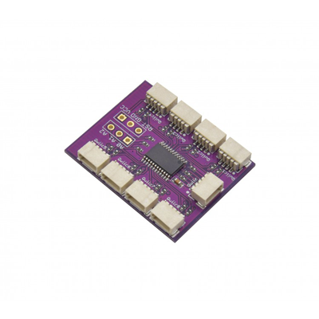

# Zio Qwiic Mux

> This product can be available for purchase [here](https://www.smart-prototyping.com/Zio-Qwiic-Mux.html).

#### Description

This board is awesome. It lets you switch between sets of Qwiic device chains that are isolated from one another.

That means that you can use up to eight of an I2C device that has a fixed address. And because this board has eight address option itself, you can actually control many more than that.

> The schematic for our Qwiic Mux board is a derivative of the [Adafruit TCA9548A 1-to-8 I2C Multiplexer Breakout](https://learn.adafruit.com/adafruit-tca9548a-1-to-8-i2c-multiplexer-breakout/overview).

One of the limitations of I2C, on which Qwiic is based, is that some sensors only have one or two changeable bits in their address. Some even have a single fixed address. That means that you can’t use more than one of them connected to the same I2C bus on your microcontroller. What if you want to use more than one? Thanks to the handy-dandy Zio Qwiic MUX, you can use up to EIGHT of that fixed-address TOF range-finder module that you want to stick on every side of your drone for automatic collision avoidance. Your shattered dreams of building an I2C-based motion capture suit using BNO080 breakouts? Shattered no more, my friend. We’ve got your sixteen sensors right here.

What’s the trick? The TCA9548APWR is an eight-channel two-wire bus multiplexer. It is, in fact, an I2C device itself. By changing the value of one of the TCA9548APWR’s registers, you can route the connection from your MCU to any of eight pairs of pins, each with their own set of pullup resistors (optional, via solder jumpers), on the other side of this IC. It’s a lot like a railroad track switch. Want to know what else is cool about that? It overcomes the 4-foot wire-length limitation of Qwiic. Each one of those ports counts as a different bus.

We don’t do any voltage level shifting on these ports. Each and every one is an unadulterated 3.3v Qwiic port. The TCA9548APWR also has three configurable address bits, so you can use up to eight of them on the same bus. Or you can get really crazy and connect eight other Zio Qwiic MUX boards, all with the same address, to each of the eight ports on your first Zio Qwiic MUX. And then… well, exponents being what they are, you could split your one I2C bus into over sixteen million of them using only these boards. That is, if you had the money and space and inclination. Frankly speaking, we don’t recommend it. But if you want to place an order for the two million or so boards necessary to do it, we could probably work out some kind of volume discount for you. Just don’t ask us to offer a power supply solution for that.

#### Specification

* Weight: 2.6g (0.09oz)
* IC: TCA9548A
* I2C address: 0x70- 0x77
* Default:0x70

#### Links

* [TCA9548A datasheet](https://www.smart-prototyping.com/image/data/NOA-RnD/101900%20Mux/tca9548a.pdf)
* [Example Code- Connect two TOF sensor with Mux](https://www.smart-prototyping.com/image/data/NOA-RnD/101900%20Mux/Zio_Qwiic_Mux_TOF_Example_Code.zip)
* [Eagle files](https://github.com/ZIOCC/Qwiic_Mux)

##### Connections for example code

Adafruit also has a [great little tutorial](https://learn.adafruit.com/adafruit-tca9548a-1-to-8-i2c-multiplexer-breakout/wiring-and-test) with some very simple Arduino functions for using it, the most important being:
<pre>
<code>
#define TCAADDR 0x70
void tcaselect(uint8_t i) {
  if (i > 7) return;
  Wire.beginTransmission(TCAADDR);
  Wire.write(1 << i);
  Wire.endTransmission();
}
</code>
</pre>

Just drop that into your sketch and then call <code>tcaselect(x);</code> where x is the port, from 0 to 7, that you want to activate.

And to disable all of the ports (in the case that you're using more than one of these board, and need to prevent an address collision between identical devices connected to each) just call this function with that Qwiic Mux's address (set by soldering closed a combination of the A0, A1, and A2 jumpers on the bottom of the PCB) as the only argument:

<pre><code>
void tcadisable(uint8_t tcaaddress){ 
  Wire.beginTransmission(tcaaddress); 
  Wire.write(0);  // no channel selected 
  Wire.endTransmission(); 
} 
</code></pre>

> All Zio products are released under the [Creative Commons Attribution, Share-Alike License](https://creativecommons.org/licenses/by-sa/4.0/), and in accordance with the principles of the [Open Source Hardware Association's OSHW Statement of Principles 1.0 and OSHW Definition 1.0](https://www.oshwa.org/definition/).

> ###### About Zio
> Zio is a new line of open sourced, compact, and grid layout boards, fully integrated for Arduino and Qwiic ecosystem. Designed ideally for wearables, robotics, small-space limitations or other on the go projects. Check out other awesome Zio products [here](https://www.smart-prototyping.com/Zio).

